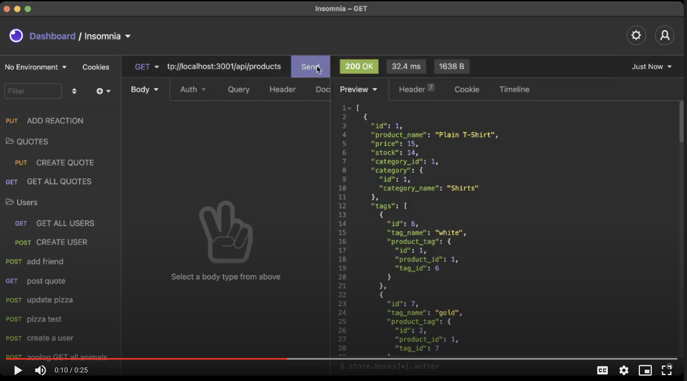

# E-Commerce Back End

## **Description**
This is a Back End application for e-commerce using Sequelize to interact with MySQL database

## **Table of Contents**
* [Installation](#installation)
* [Usage](#usage)
* [Contributions](#contributions)
* [Licenses](#licenses)
* [Badges](#Badges)
* [Questions](#questions)

### **Installation**
npm i inquirer express

### **Usage**
⏯ [walkthrough video link](https://drive.google.com/file/d/1AGjQSJgmy9ToN2rP-ragsPQMNiid-J8N/view?usp=sharing)

### **Technologies Used:**
* Node.js
* JavaScript
* npm
* MySQL

### *Contributions*

### *Licenses*
MIT license

### *Badges*

### *Questions*
If you have any questions, reach out to me on Git Hub https://github.com/JJLindsey, or send me a message jlindsey010@gmail.com.

©Jennifer Lindsey 2021